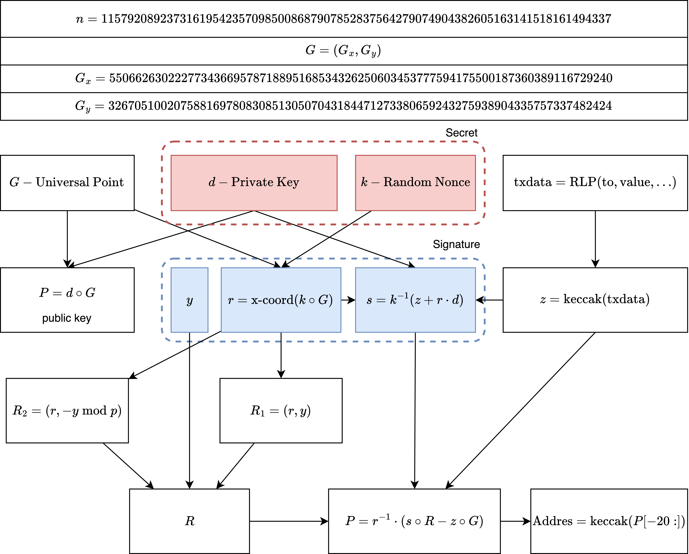

### Purpose

`from` adgress is not directly included into a raw transactions data, some efforts must be applied to extract it.

### Data Flow of Public Key Recovery




Red are secrets, blues are part of the public signature. 


### Code Usage

You should supply a file with raw transaction data to the program:

```
cargo run data/tx1
```


Output: 

```
Transaction: Eip4844(Signed { tx: TxEip4844WithSidecar(TxEip4844WithSidecar { tx: TxEip4844 { chain_id: 1, nonce: 751394, gas_limit: 222415, max_fee_per_gas: 67345492250, max_priority_fee_per_gas: 2100000000, to: 0x1c479675ad559dc151f6ec7ed3fbf8cee79582b6, value: 0, access_list: AccessList([]), blob_versioned_hashes: [0x0170fd889ada2c0970fc5d8d90c4aa0974843e97d42b7d32d9ada74323ae0efb, 0x01844ee3a27c9471d5129e095f239720b7ef74e95c8457e1a2ce9556355997ae, 0x014219b99df8b77a55d5abb1704e3fbf7639fb05185c9906bb4e74ac532e8dd7], max_fee_per_blob_gas: 14300590, input: 0x3e5aa08200000000000000000000000000000000000000000000000000000000000c3f3000000000000000000000000000000000000000000000000000000000001c3e53000000000000000000000000e64a54e2533fd126c2e452c5fab544d80e2e4eb50000000000000000000000000000000000000000000000000000000010804c900000000000000000000000000000000000000000000000000000000010804e64 }, sidecar: BlobTransactionSidecar { blobs: 3, commitments: [0x9546e0d678aca80fdbba23f65d00f005e3c7dee140e706dc0c5142b9c41ab810821a6c296974fa31d721701c97afbadf, 0xb262442ef5dd2d0d5c37cc9bc82ffb3202693d1d61136b8b99c6ed888de31219a8dcb7897e6b4308bfa939f48468948e, 0x84a3a54fe7a3719d2109d701b2885b2778658a62466f071b428c882eabbd2dba49f0fd2a72eb3de7d229cc312b67d4f6], proofs: [0xa410b079d1770ca1ee1eaa932575487a1a6343ba98e991c340447b91b93173fdf7d97447d33e328f7c2cc6db06687d62, 0xa79990838d78980fd35042949dceddb83803f9733e87327856e75b79e6f23c318d4d0daf616b386b228ebc56207853ac, 0x8cde8fde63501c4ff92ba7a58bfc55b585dd7f1f1e93b76b1a7b707386dae86225da2ad68b038002318ef7ae56befdb0] } }), signature: PrimitiveSignature { y_parity: true, r: 27181614584045877226283721296203675045753348271766829845051632420475682249845, s: 11274233634643535130239234777043382325596623270538702034487403476439225957524 }, hash: 0x355c24cda7b09e1d202d42c7930a86d3d141bfdb8b644c1fdcfcd0b8932e65f5 })


keccak(rlp(data)): 0xc0c0654d64aa057b5addd7e82d84d1d19b3ca74a1a8aa58652972dc79db63fbb
r: 27181614584045877226283721296203675045753348271766829845051632420475682249845
s: 11274233634643535130239234777043382325596623270538702034487403476439225957524
v: true

Recovered Address: 0x25f08b1fd0642db8986996dfceef4ae90272ce55
```


